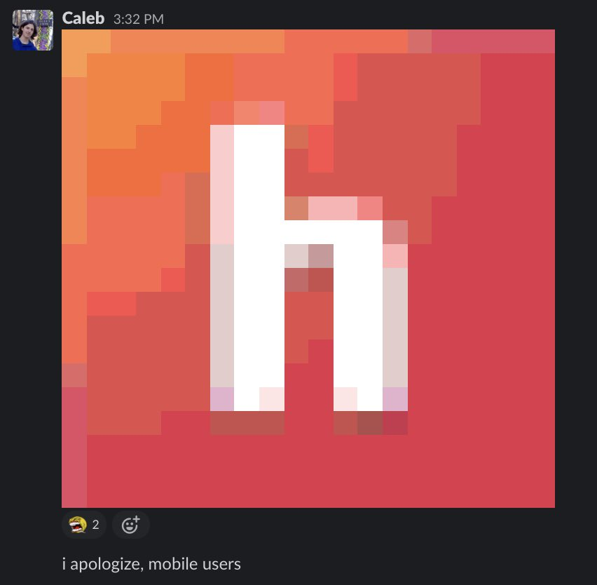

# emojimage

> An experiment in rendering images with Slack custom emojis.

## Example

## Usage

### 1. Initializing your workspace

First, you'll need to upload 1,332 custom emoji to your workspace. Fortunately, there's a convenient script in this repo to do so!

First, grab a client API token from Slack. **The only way to get one is to log in to your Slack workspace** with a browser, open your devtool's "network" tab, and capture the token from a request. It'll look something like `xoxc-123-45678-90`.

Assuming you have [Go](https://golang.org) installed, just run `SLACK_TOKEN=xoxc-123 go run ./init` (replacing `xoxc-123` with your client token). ⚠️ **This will upload 1,332 emoji to your Slack workspace, and could take up to an hour to run!** Expect to run into a lot of rate limits (the included script will gracefully handle those).

### 2. Generating an image

To generate the message text for an image, simply run `go run ./generate_image <path to PNG file> <optional width/height>`. **Only PNG files are supported out of the box**.

The width/height parameter defaults to 20 (the value used in the above screenshot)

Copy the output, then paste it into Slack!
